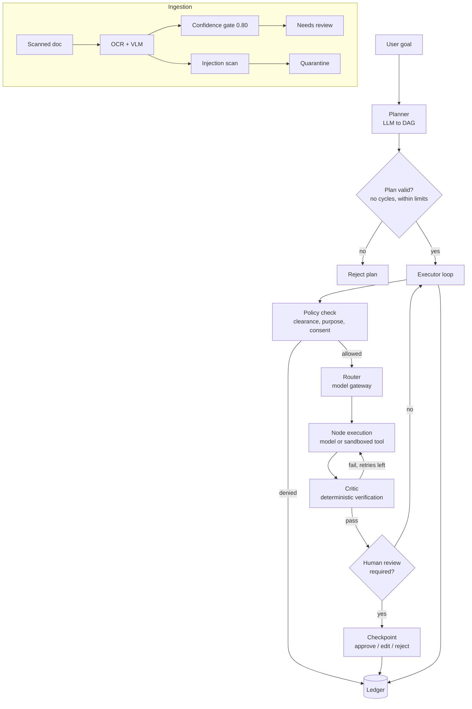

# Sovereign Agentic AI Workbench

A **local-first, zero-egress agentic workbench** for document-heavy, regulated workflows. It plans multi-step tasks as a DAG, runs them with bounded autonomy, verifies every step, pauses for human review where it matters, and records an audit trail of every security-relevant decision.

The reference workflow is an **industrial inspection review**: scan in a report, extract fields with confidence scores, have a human confirm anything uncertain, retrieve the relevant SOPs under governance rules, draft an approval note, approve it, and export a `.docx` with citations.

> **Status:** Phase 1 (ledger, model gateway) and most of Phase 2 (security, orchestration, extraction, governance) are implemented and unit-tested. The API layer, retrieval service, UIs and end-to-end flow are **not built yet**. See [Project status](#project-status) for the honest breakdown.

---

## Table of contents

1. [Design principles](#design-principles)
2. [Architecture](#architecture)
3. [Repository layout](#repository-layout)
4. [Getting started](#getting-started)
5. [Running the tests](#running-the-tests)
6. [Components in depth](#components-in-depth)
7. [Security model](#security-model)
8. [Project status](#project-status)
9. [Known limitations](#known-limitations)
10. [Development notes](#development-notes)

---

## Design principles

| Principle | What it means in practice |
|---|---|
| **Zero egress** | Models run locally (Ollama on `localhost:11434`). Code execution happens in a sandbox with no network. Nothing is sent to external hosts. |
| **Bounded autonomy** | Every task has hard limits on node count, depth, retries, tool calls and wall-clock time (`TaskLimits`). |
| **Verify, don't trust** | Node outputs are checked by a deterministic critic (citations, fields, schema). No LLM call is needed to pass or fail a step. |
| **Human in the loop** | Low-confidence fields and flagged nodes stop the task at a checkpoint. A named human approves, edits or rejects. |
| **Audit everything that matters** | Policy denials and human decisions are ledgered with the actor. Edited content is stored as a SHA-256 hash, never as text. |
| **Data carries its rules** | Classification, allowed purposes and consent travel with the data and are enforced at query time. |
| **Documents are data, never instructions** | Planning never reads document text. Extracted text is scanned for injected instructions and quarantined for human review. |

---

## Architecture



**Execution loop in one paragraph.** `ready_nodes()` returns nodes whose dependencies are `DONE`. Each is policy-checked, routed to a model, executed (up to `max_retries`, with critic feedback fed back into the next attempt), verified, and then either completed or parked at a human checkpoint. When no node is ready, the task is `COMPLETED`, `FAILED` (a node exhausted its retries or was denied) or `PAUSED` (waiting on a checkpoint).

---

## Repository layout

```
apps/
  ledger/             Hash-chained audit ledger service (FastAPI, port 8100)
  model_gateway/      Router: classifier, registry, selector over local models (port 8200)
  orchestrator/       Task graph, planner, critic, executor, Postgres persistence
  multimodal/         OCR + VLM extraction, confidence gating, quarantine
  governance/         PII redaction, classification, consent, injection scanner
  sandbox/            File broker, container runner, seccomp profile
  tool_broker/        Tool registry
libs/
  ledger_client.py    Client for the ledger service
  model_verifier.py   Verifies model artifacts
  exfiltration_test.py  Egress checks
schemas/              JSON Schemas (router decision, ledger entry, task graph, ...)
phase0-pack/          Frozen Phase 0 specs, schemas and demo data
demo_data/            Synthetic reports, SOPs, PII and prompt-injection test files
tests/                Unit and integration tests
pytest.ini            Sets pythonpath so `apps.*` imports resolve
requirements.txt      Pinned dependencies
```

> `schemas/` and `phase0-pack/schemas/` are identical copies. Keep them in sync when you change a schema.

---

## Getting started

### Prerequisites

- Python 3.9+ (developed and tested on 3.9)
- [Ollama](https://ollama.com) running locally for model inference, with the models you plan to route to (the code references `qwen2.5vl:7b` for extraction and `qwen2.5-coder:7b` for code tasks)
- Docker, for the sandbox and its egress checks
- PostgreSQL, for production task persistence (tests use an in-memory stand-in)

### Install

```bash
git clone <your-repo-url>
cd <repo>

python3 -m venv .venv
source .venv/bin/activate
python -m pip install --upgrade pip
python -m pip install -r requirements.txt
```

On macOS with Homebrew Python, a virtual environment is required (PEP 668 blocks system-wide `pip install`).

PaddleOCR is optional. If it is not installed, the OCR backend raises a clear `ImportError` and the VLM path still works.

### Services

The ledger and model gateway each ship a Dockerfile (`apps/ledger/Dockerfile`, `apps/model_gateway/Dockerfile`) with health checks on ports **8100** and **8200**. Check those files for the exact run commands.

---

## Running the tests

Always run pytest through the virtual environment's Python:

```bash
python -m pytest -q                      # full suite
python -m pytest tests/test_b7_b9_orchestrator.py -v
python -m pytest --cov=apps --cov=libs --cov-report=term-missing -q
```

Last verified full run: **186 passed**. The quarantine tests added afterwards (`tests/test_extraction_quarantine.py`) bring the total higher; run the suite to get the current number.

### Test map

| File | Covers |
|---|---|
| `test_a8_a13_sandbox_security.py` | File broker, sandbox runner, seccomp, tool registry, model verifier, exfiltration |
| `test_b7_b9_orchestrator.py` | Task graph state machine, DAG validation, planner, critic |
| `test_executor_loop.py` | Happy path, retry with feedback, retry exhaustion, policy denial, checkpoints, persistence round trip |
| `test_checkpoint_audit.py` | Decision validation, actor recording, ledger events, edit verification |
| `test_b12_b13_extraction.py` | OCR + VLM extraction, confidence gating |
| `test_extraction_quarantine.py` | Injection quarantine, export blocking, planner-prompt guard |
| `test_injection_scanner.py` | Scanner against the real attack memo and benign maintenance text |
| `test_c7_c10_governance.py` | PII redaction, classification hierarchy, consent registry |
| `tests/ledger`, `tests/model_gateway` | Phase 1 services |

### Verifying the sandbox yourself

The unit tests do not replace a real isolation check. With Docker running:

```bash
# Control: no restrictions, should print EGRESS WORKED
docker run --rm python:3.11-slim \
  python -c "import socket; s=socket.socket(); s.connect(('1.1.1.1',80)); print('EGRESS WORKED')"

# Seccomp profile alone, network enabled: should fail with PermissionError
docker run --rm --security-opt seccomp=apps/sandbox/seccomp.json python:3.11-slim \
  python -c "import socket; s=socket.socket(); s.connect(('1.1.1.1',80)); print('EGRESS WORKED')"
```

---

## Components in depth

### Orchestrator (`apps/orchestrator`)

- **Task graph.** `TaskGraph` holds `TaskNode`s. Node states: `pending, ready, running, done, failed, needs_review`. Task states: `planning, running, paused, completed, failed`. `validate_dag()` rejects cycles and enforces node-count and depth limits.
- **Node types.** `ocr_extract`, `retrieve_sops`, `draft_note`, `run_python`, `approve_note`, `export_docx`.
- **Planner.** Produces the DAG as JSON from `goal`, `purpose`, `user_id` and `user_clearance`. Free-form request fields (`context`, `constraints`) are deliberately **not** rendered into the prompt, and a test enforces that.
- **Critic.** Deterministic checks per node type. `RetryPolicy` decides whether to retry and supplies feedback for the next attempt.
- **Executor.** Injected callables keep it testable and service-agnostic:

  | Callable | Role |
  |---|---|
  | `policy_check(user_id, node)` | Allow or deny the node |
  | `router_select(node)` | Choose the model |
  | `executor_fn(node, model_id, feedback)` | Run the node (note: three arguments) |
  | `ledger_emit(event_type, payload)` | Record an audit event |

- **Checkpoints.** `handle_checkpoint_decision(task_id, checkpoint_id, decision, edit_data, decided_by, ledger_emit)` validates before mutating, verifies edited output through the critic, records the actor, and ledgers `checkpoint.decided`. Edits are hashed (SHA-256), not stored in the ledger.
- **Persistence.** `PersistenceBackend` interface with a Postgres/JSONB implementation. Pending checkpoints and decisions are serialized with the task.

### Extraction (`apps/multimodal`)

OCR (PaddleOCR) gives text with bounding boxes and confidences. A VLM served by local Ollama returns structured fields. **Confidence gating** flags any field below 0.80 (`needs_review`); `ready_for_export()` is false until flagged fields are confirmed. See [Security model](#security-model) for quarantine.

### Governance (`apps/governance`)

| Module | Behaviour |
|---|---|
| `pii_redactor` | Email, phone, Aadhaar, PAN, credit card, IP address |
| `classification` | `PUBLIC < INTERNAL < CONFIDENTIAL < BOARD_ONLY`; outputs inherit the highest classification of any input |
| `consent` | Grant and revoke per purpose; usage tracking |
| `injection_scanner` | Heuristic tripwire for instruction-like text in documents |

Intended query-time rule: a chunk is retrievable only if `user.clearance >= chunk.classification`, the stated `purpose` is in `chunk.allowed_purposes`, and consent is active.

### Model gateway (`apps/model_gateway`)

Classifies each request (task type, modality, complexity, sensitivity, confidence), selects an allowed local model by rule, and emits a router decision record validated against `schemas/router_decision.schema.json`. Low classifier confidence sets `needs_clarification`.

### Ledger (`apps/ledger`)

Hash-chained, append-only audit log (`chain.py`, `store.py`) with a thin client in `libs/ledger_client.py`.

---

## Security model

Defence in depth: each layer assumes the one above it can fail.

| Threat | Control | Verification |
|---|---|---|
| Code exfiltrates data over the network | Sandbox with `--network none` plus a seccomp profile that denies socket syscalls | Docker checks above: seccomp alone blocks `connect` |
| Prompt injection via documents | (1) Plan is built from `goal/purpose/user/clearance` only. (2) Injection scanner quarantines documents that trip two or more independent rules. (3) Sandbox has no network. | Unit tests with the real attack memo; planner-prompt guard test |
| Silent extraction errors | Confidence gate at 0.80; export blocked until flagged fields are confirmed | Extraction tests |
| Unauthorized node execution | Policy check before every node; denial is ledgered as `policy.denied` | Executor tests |
| Anonymous or unverifiable approvals | `decided_by` required in practice, `checkpoint.decided` ledgered, edits verified by the critic | Checkpoint audit tests |
| PII leaking into stored text | Regex redaction at ingest | Governance tests |
| Downgrading sensitive data | Classification inheritance | Governance tests |

**Quarantine.** After extraction, field text is scanned for override phrases, text addressed to the AI, concealment requests, tool invocations and exfiltration instructions. Two or more distinct rules quarantines the document: `ready_for_export()` stays false regardless of confidence until a named reviewer calls `clear_quarantine(by=...)`. Re-scanning revokes any prior clearance.

**Honest limits of the scanner.** It is a tripwire for known attack shapes, not a guarantee. A paraphrased attack can slip past the regexes. The structural controls (fixed plan, no tool calls created from content, network-less sandbox) are the real defences.

---

## Project status

| Area | Status |
|---|---|
| Phase 0 specs, schemas, demo data | Done |
| Phase 1: ledger, model gateway | Done |
| A8-A13: sandbox, file broker, seccomp, tool registry, verifier, exfiltration tests | Done |
| B7-B9: task graph, planner, critic, executor | Done, tested against in-memory persistence |
| B10: checkpoint logic | In the executor; no API in front of it yet |
| B12-B13: extraction, confidence gating | Done |
| Injection quarantine | Implemented; verify it is committed |
| C7, C9, C10: PII, classification, consent | Done |
| **B14:** wire orchestrator to real ledger, router, policy, tools | **Not built** |
| **B11:** WebSocket event stream | **Not built** |
| **C12:** `.docx` export with citations | **Not built** |
| **C13:** review panel UI | **Not built** |
| **C14:** live agent trace UI | **Not built** |
| Retrieval service (ingest, embeddings, governed search) | **Not built** |
| API layer (upload, start task, decide checkpoint, export) | **Not built** |
| End-to-end flow test | **Not built** |

Target flow, not yet runnable end to end:

```
upload scan -> OCR+VLM -> confidence gate / quarantine -> human confirms
  -> governed SOP retrieval -> draft note -> human approval -> .docx export
```

---

## Known limitations

- **Postgres has never run against a real database.** `postgres_persistence.py` has low coverage and the tests use an in-memory stand-in. JSONB round-tripping is untested.
- **`asyncpg` is imported at package load**, so `apps.orchestrator` will not import without it, even when no database is used. Consider importing it lazily.
- **"Bounded concurrency" is sequential.** The executor awaits ready nodes one at a time.
- **Human checkpoint decisions require a `ledger_emit`** to be audited. Callers that omit it get no audit event.
- **The sandbox runner wrapper has low test coverage.** The seccomp profile itself was verified in Docker; the Python code around it is mostly untested.
- **Seccomp profile architecture map lists x86_64 only.** It worked on an arm64 Docker VM in testing; verify on your deployment target.
- **Injection scanner is heuristic** (see above).
- **Edited checkpoint output goes through the critic.** Review UIs must only offer edits the critic can validate for that node type.
- **Schemas use `additionalProperties: false`.** Adding a field to emitted data without updating the schema fails validation (this has already happened once, with `needs_clarification`).

---

## Development notes

- Use `python -m pytest`, not bare `pytest`, so the active virtual environment is used.
- Python 3.9 compatibility: avoid `X | Y` type unions and `match` statements.
- When changing a schema in `schemas/`, apply the same change to `phase0-pack/schemas/`.
- Prefer mutation checks for new safety tests: temporarily break the control, confirm the test fails, then `git checkout` the file. A test that stays green when the code is broken proves nothing.
- Do not commit personal files. `.gitignore` excludes `.venv/`, `.pytest_cache/`, `__pycache__/`, `test_run.log`, `.coverage` and `TanishqYadav_*.pdf`.
